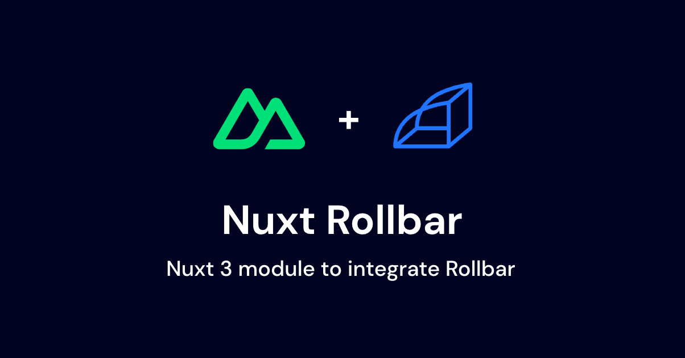

# Nuxt Rollbar

[](https://www.npmjs.com/package/nuxt-rollbar)

> [Nuxt 3](https://nuxt.com) module to integrate [Rollbar](https://rollbar.com).

## Setup

```bash
# pnpm
pnpm add -D nuxt-rollbar

# npm
npm i -D nuxt-rollbar

# yarn
yarn add -D nuxt-rollbar
```

## Basic Usage

Add `nuxt-rollbar` to the `modules` section of your Nuxt configuration and provide your Rollbar server and/or client access token(s).

```ts
// `nuxt.config.ts`
export default defineNuxtConfig({
  modules: ['nuxt-rollbar'],

  rollbar: {
    serverAccessToken: 'SERVER_ACCESS_TOKEN',
    clientAccessToken: 'CLIENT_ACCESS_TOKEN',
  },
});
```

Done! Rollbar will now run in your application.

## Configuration

### Client Only

> ℹ️ `useRollbar` composable will return `undefined` in the server.

```ts
export default defineNuxtConfig({
  modules: ['nuxt-rollbar'],

  rollbar: {
    clientAccessToken: 'CLIENT_ACCESS_TOKEN',
    mode: 'client',
    config: {
      // Rollbar configuration
    },
  },
});
```

### Server Only

> ℹ️ `useRollbar` composable will return `undefined` in the client.

```ts
export default defineNuxtConfig({
  modules: ['nuxt-rollbar'],

  rollbar: {
    serverAccessToken: 'SERVER_ACCESS_TOKEN',
    mode: 'server',
    config: {
      // Rollbar configuration
    },
  },
});
```

### Both server and client

```ts
export default defineNuxtConfig({
  modules: ['nuxt-rollbar'],

  rollbar: {
    serverAccessToken: 'SERVER_ACCESS_TOKEN',
    clientAccessToken: 'CLIENT_ACCESS_TOKEN',
    config: {
      // Rollbar configuration
    },
  },
});
```

## Module Options

| Option              | Type                    | Default | Description                                           |
| ------------------- | ----------------------- | ------- | ----------------------------------------------------- |
| `clientAccessToken` | `string`                | `''`    | Rollbar client access token.                          |
| `serverAccessToken` | `string`                | `''`    | Rollbar server access token.                          |
| `mode`              | `string`                | `'all'` | Environment mode in which your Rollbar instance runs. |
| `config`            | `Rollbar.Configuration` | `null`  | Rollbar configuration.                                |

## Composables

As with other composables in the Nuxt 3 ecosystem, they are auto-imported and can be used in your application's components.

> ℹ️ Since the Rollbar instance is available in both the client and server environments, you can use it in either context.

### `useRollbar`

Return the Rollbar instance if it is available and configured for the environment (client or server). Otherwise, return `undefined`.

**Type Declarations**

```ts
function useRollbar(): Rollbar;
```

**Example**

```ts
const rollbar = useRollbar();

rollbar.log('Hello, world!');
```

This composable is a simple alias for

```ts
useNuxtApp().$rollbar;
```

## 💻 Development

1. Clone this repository
2. Enable [Corepack](https://github.com/nodejs/corepack) using `corepack enable`
3. Install dependencies using `pnpm install`
4. Run `pnpm run dev:prepare`
5. Start development server using `pnpm run dev`

## Thanks

Special thanks to:

- **[nuxt-plausible](https://github.com/nuxt-modules/plausible)**
- **[nuxt-rollbar-module](https://github.com/gaelreyrol/nuxt-rollbar-module)**

Appreciate the inspiration and groundwork provided.

## License

[MIT](./LICENSE) License © 2023 [Jairo Blatt](https://github.com/jairoblatt)
